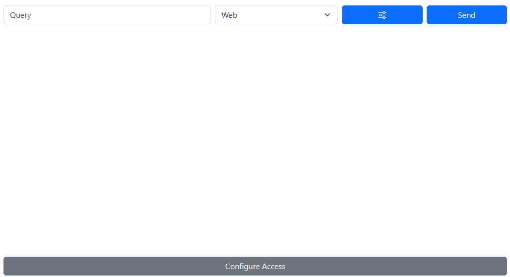

# Brave Search API Playground

_A work in progress_.

Run the server: `node server/index.js`. With the server running, run `npm run dev` to spin-up the front-end.

You'll need an API key to enjoy the playground: get a free key at https://api.search.brave.com.

Below is a preview of the playground. The query is purposefully mispelled to test the 'spellcheck' flag in the Web Request Parameters.

